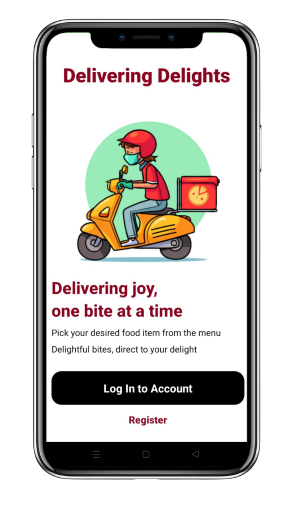
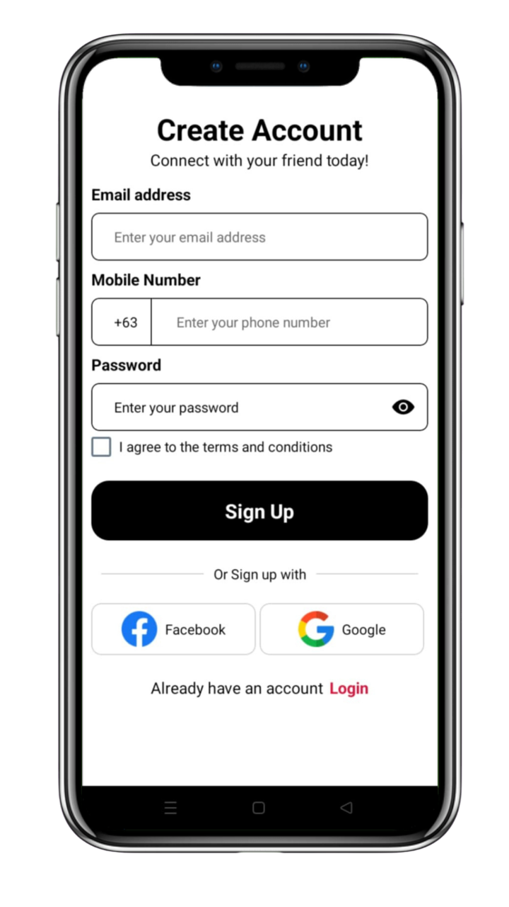
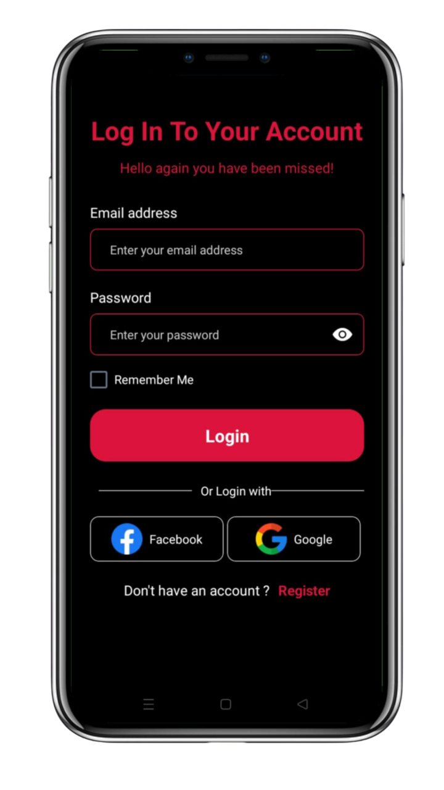
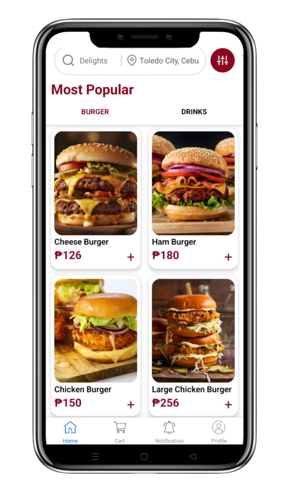

# DeliveringDelights
Food Delivery Mobile App.

# Features
* Proactive Notifications
* Self-Service Problem Reporting 
* Order Tracking
* User Feedback and Rating System

# Course Overview
* Basic React Native Components
* Database Design using Appwrite
* User Registration & Authenticaiton
* Deployment

# Tech Stack
* React Native
* AppWrite
* HTML, CSS and JS

# Home Screen
  

# Sign Up Screen
  

# Sign In Screen
  

# Tabs Screen
  

# Walkthrough
[DeliveringDelights](https://youtu.be/Pi_CR6bGphA?si=ZV1vFWx_4d4JpCUb)

* In this video is the walkthrough of the Mobile App **DeliveringDelight's** Source Code and User Interface. This video highlights the key project files such as; **(auth)**, **(tab)** **CustomButton**, **FormField**, **Onboarding Screen** and **Index Screen**.